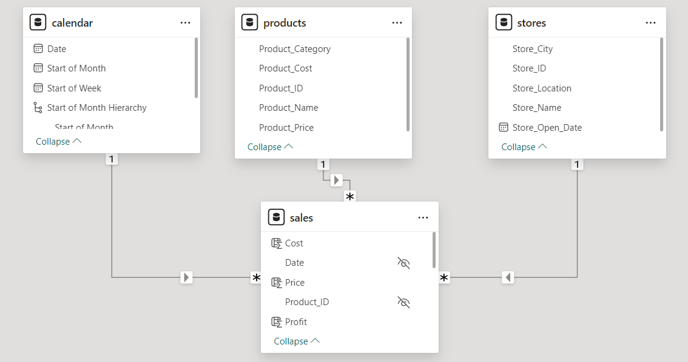
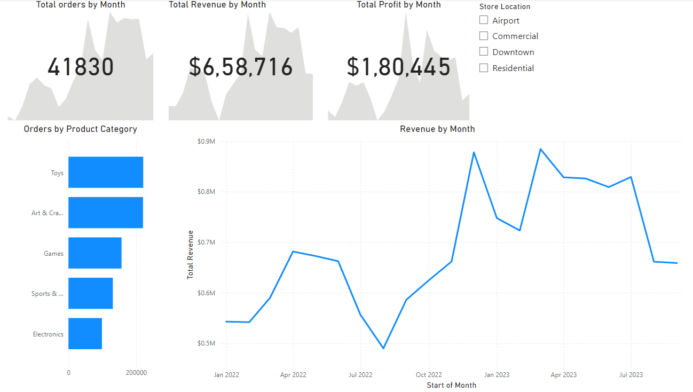

#  Toy Store KPI Report

##  Problem Statement
In this project, I have created an interactive and dynamic report that the leadership team can use to monitor key business metrics and high level trends. The objective of this dashboard is
to display how many stores does Maven Toys operate, how many transactions were recorded and what are the lowest and highest priced products.

### Data Preview
The dataset contains of four schemas:
1. Sales.csv: This table tracks the record of each sale, 'Sales_ID' is the primary key and it stores from which store the product is bought, the product id and the number of units sold
2. Product.csv: It stores information of all the products like product name, category, cost of goods and price
3. Stores.csv: It stores information of all the stores like store name, city, location etc
4. Calendar.csv: It records the dates on which the transactions are processed.

###  Steps Followed
1.  Load the dataset(the csv files) into PowerBI
2.  Identify the primary and secondary key for all the tables and remove any duplicate rows or rows with missing values
3.  Perform data profiling in PowerBI, check for the number of distinct, unique and valid values, add existing columns like 'Start of Month' and 'Start of Week' in the date table
4.  Create a relational model using PowerBI data model, the model takes the form of a star schema, with 1:many relationships between fact(sales) and dimension tables
5.  Create a hierarchy containing the 'start of month', 'start of month' and 'date' fields and hide all the foreign keys from the report view in sales table
6.  Create new columns 'cost' and 'Price' referencing the 'Product_Cost' and 'Product_Price' in the product table using the 'Related' function
7.  Add new columns 'Revenue' and 'Profit' using the newly created columns in the sales table
8.  Add new measures 'Total Orders' by counting the distinct values in the 'Sales_ID' column and 'Total Revenue' and 'Total Profit' by summing all the values in 'Revenue' and 'Profit' columns
9.  In the PowerBI dashboard, add the KPIs, 'Total orders', 'Revenue' and 'Start of Month' and create a slicer containing the 'Store Location'
10.  Create a horizontal bar chart that displays the total number of orders by product category and plot a revenue trend by month
    
 

### Inference
1.    High-Level KPIs:
-    Total Orders: The company processed a significant volume of 41,830 orders over the given time frame, indicating robust operational activity.
-    Revenue and Profit Trends: A total revenue of $6,58,716 and a profit of $1,80,445 reflect a healthy profit margin. These metrics allow the team to assess overall financial health and profitability.

2.    Product Insights:
-    Top-Selling Categories: Toys lead in terms of orders, followed by Art & Craft, and Games, emphasizing the primary revenue drivers for Maven Toys.
-    Product Pricing: The analysis of the lowest and highest-priced products can help the team identify gaps or opportunities for margin optimization.

3.    Seasonal Trends:
-    Revenue by Month: The dashboard highlights fluctuations in revenue over time, providing insights into seasonal trends and periods of peak activity (e.g., spikes around holidays or promotions).
-    Monthly Order Trends: The visualizations help identify any consistent growth or downturns in customer transactions.

4.    Geographical Performance:
-    The slicer for store locations enables the leadership to assess performance by store type (e.g., Airport, Commercial, Downtown, Residential). This can aid in resource allocation and marketing strategy adjustments.

### Conclusion
The Maven Toys dashboard effectively highlights key business metrics, such as total orders, revenue, and profit, while providing insights into product performance, seasonal trends, and store-level analysis. This interactive tool empowers the leadership team to make data-driven decisions, optimize operations, and strategize for future growth.

